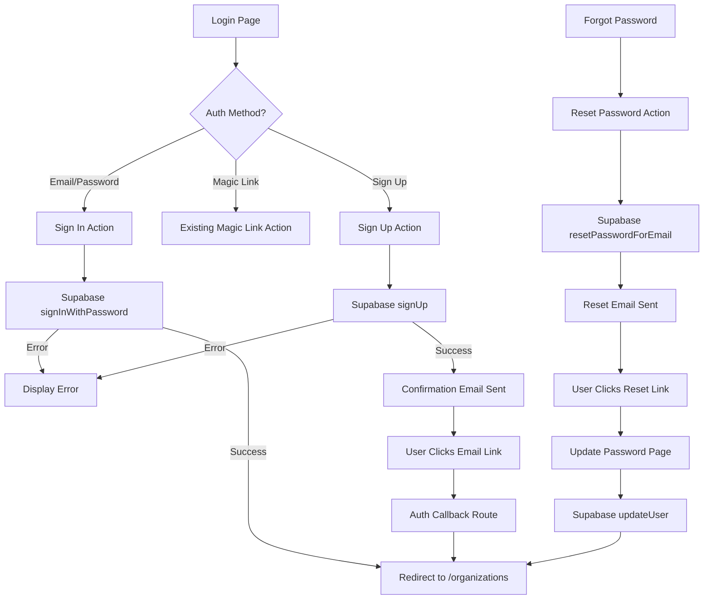

# Design Document: Email/Password Authentication

## Overview

This design adds email/password authentication as an alternative to the existing magic link authentication in the Next.js application. The implementation leverages Supabase's built-in authentication methods and integrates seamlessly with the existing authentication infrastructure including the auth callback route, middleware session management, and Supabase client configuration.

## Architecture

The authentication flow follows a client-server architecture where:
- The login page (client component) handles user input and form submission
- Server actions process authentication requests via Supabase
- The existing auth callback route handles email confirmation redirects
- Middleware manages session state across the application



## Components and Interfaces

### 1. Login Page Component (`app/login/page.tsx`)

Updated client component with tabbed interface for authentication methods.

```typescript
interface LoginPageState {
  authMethod: 'password' | 'magic-link';
  email: string;
  password: string;
  isSignUp: boolean;
  error: string | null;
  loading: boolean;
}
```

### 2. Server Actions (`app/login/actions.ts`)

New and updated server actions:

```typescript
// New action for email/password sign in
export async function signInWithPassword(formData: FormData): Promise<AuthResult>

// New action for email/password sign up
export async function signUpWithPassword(formData: FormData): Promise<AuthResult>

// New action for password reset request
export async function requestPasswordReset(formData: FormData): Promise<AuthResult>

// Existing action (unchanged)
export async function signInWithMagicLink(formData: FormData): Promise<void>
```

### 3. Password Reset Page (`app/login/reset-password/page.tsx`)

New page for entering new password after clicking reset link.

```typescript
interface ResetPasswordPageProps {
  searchParams: { code?: string; error?: string }
}
```

### 4. Auth Result Interface

```typescript
interface AuthResult {
  success: boolean;
  error?: string;
  message?: string;
  requiresEmailConfirmation?: boolean;
}
```

## Data Models

No new database models are required. Supabase handles user authentication data internally. The existing User model in Prisma will continue to be synced with Supabase auth users through the existing auth callback mechanism.

### Password Validation Rules

- Minimum length: 8 characters
- Required: at least one letter and one number (enforced client-side for UX)

## Correctness Properties

*A property is a characteristic or behavior that should hold true across all valid executions of a system-essentially, a formal statement about what the system should do. Properties serve as the bridge between human-readable specifications and machine-verifiable correctness guarantees.*

### Property 1: Password length validation rejects short passwords
*For any* password string shorter than 8 characters, the password validation function SHALL return an error indicating the password is too short.
**Validates: Requirements 1.2, 3.4**

### Property 2: Invalid credentials are rejected
*For any* email/password combination where either the email doesn't exist or the password doesn't match, the sign-in function SHALL return an authentication error.
**Validates: Requirements 2.2**

### Property 3: Email preservation across auth method toggle
*For any* email address entered in the login form, when the user toggles between email/password and magic link authentication methods, the email address SHALL remain in the input field.
**Validates: Requirements 4.4**

### Property 4: Valid email format validation
*For any* string that is not a valid email format, the email validation function SHALL return an error.
**Validates: Requirements 1.1, 2.1**

## Error Handling

### Client-Side Validation Errors
- Empty email field: "Email is required"
- Invalid email format: "Please enter a valid email address"
- Empty password field: "Password is required"
- Password too short: "Password must be at least 8 characters"

### Server-Side Authentication Errors
- Invalid credentials: "Invalid email or password"
- Email not confirmed: "Please verify your email before signing in"
- Email already registered: "An account with this email already exists"
- Rate limiting: "Too many attempts. Please try again later"
- Network error: "Unable to connect. Please check your connection"

### Error Display Strategy
- Form validation errors appear inline below the relevant input field
- Authentication errors appear in an alert banner above the form
- Errors are cleared when the user starts typing in the relevant field

## Testing Strategy

### Unit Testing
Unit tests will verify:
- Password validation logic (minimum length, format requirements)
- Email validation logic
- Form state management (auth method toggle, email preservation)
- Error message generation

### Property-Based Testing
Property-based tests will use `fast-check` library to verify:
- Password validation rejects all strings shorter than 8 characters
- Email validation correctly identifies invalid email formats
- State preservation across auth method toggles

### Integration Testing
Integration tests will verify:
- Sign up flow creates user and triggers confirmation email
- Sign in flow authenticates valid users
- Password reset flow sends reset email
- Auth callback handles confirmation codes correctly

### Test File Structure
```
lib/services/__tests__/
  auth-validation.test.ts       # Unit tests for validation functions
  auth-validation.property.test.ts  # Property-based tests
app/login/__tests__/
  actions.test.ts               # Server action tests
```

