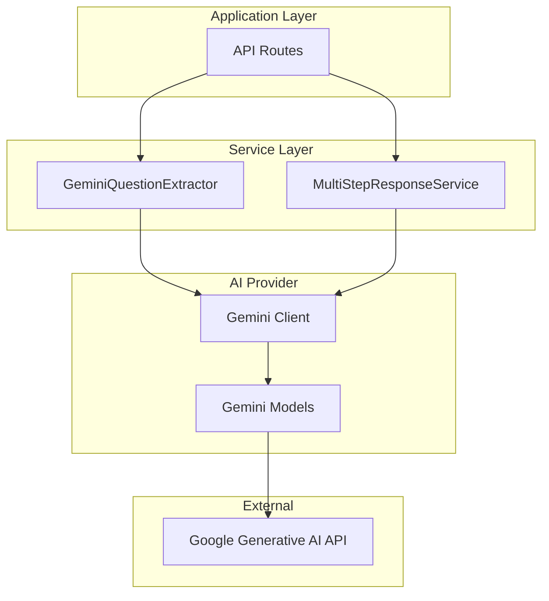

# Design Document: Gemini Integration

## Overview

This design document outlines the approach for replacing OpenAI with Google Gemini as the AI provider in the Auto RFP application. The migration involves updating two main service files (`openai-question-extractor.ts` and `multi-step-response-service.ts`), updating dependencies, and modifying configuration/documentation.

The design maintains the existing service interfaces and behavior while swapping the underlying AI provider, ensuring backward compatibility with the rest of the application.

## Architecture



### Key Changes

1. **Dependency Swap**: Replace `openai` package with `@google/generative-ai`
2. **Client Initialization**: Use `GoogleGenerativeAI` class instead of `OpenAI` class
3. **API Calls**: Replace `chat.completions.create()` with `generateContent()`
4. **Response Parsing**: Adapt to Gemini's response structure

## Components and Interfaces

### GeminiQuestionExtractor

Replaces `OpenAIQuestionExtractor` with identical interface but Gemini implementation.

```typescript
import { GoogleGenerativeAI } from '@google/generative-ai';

export class GeminiQuestionExtractor implements IAIQuestionExtractor {
  private client: GoogleGenerativeAI;
  private model: any;
  private config: AIServiceConfig;

  constructor(config: Partial<AIServiceConfig> = {}) {
    const apiKey = process.env.GEMINI_API_KEY;
    if (!apiKey) {
      throw new AIServiceError('Gemini API key is not configured');
    }
    
    this.client = new GoogleGenerativeAI(apiKey);
    this.model = this.client.getGenerativeModel({ 
      model: config.model || DEFAULT_LANGUAGE_MODEL 
    });
    
    this.config = {
      model: DEFAULT_LANGUAGE_MODEL,
      temperature: 0.1,
      maxTokens: 4000,
      timeout: 60000,
      ...config,
    };
  }

  async extractQuestions(content: string, documentName: string): Promise<ExtractedQuestions>;
  async generateSummary(content: string, documentName: string): Promise<string>;
  async extractEligibility(content: string, documentName: string): Promise<string[]>;
}
```

### MultiStepResponseService Updates

The service will use Gemini for all AI-powered reasoning steps:

```typescript
import { GoogleGenerativeAI } from '@google/generative-ai';

export class MultiStepResponseService implements IMultiStepResponseService {
  private gemini: GoogleGenerativeAI;
  private model: any;
  
  constructor(config: Partial<MultiStepConfig> = {}) {
    const apiKey = process.env.GEMINI_API_KEY;
    if (!apiKey) {
      throw new Error('Gemini API key is not configured');
    }
    
    this.gemini = new GoogleGenerativeAI(apiKey);
    this.model = this.gemini.getGenerativeModel({ model: 'gemini-1.5-flash' });
  }
}
```

### Gemini API Call Pattern

Replace OpenAI's chat completion pattern:

```typescript
// Before (OpenAI)
const response = await this.openai.chat.completions.create({
  model: 'gpt-4o',
  messages: [
    { role: 'system', content: systemPrompt },
    { role: 'user', content: userPrompt }
  ],
  temperature: 0.1,
  max_tokens: 1000,
});
const content = response.choices[0]?.message?.content;

// After (Gemini)
const result = await this.model.generateContent({
  contents: [{ 
    role: 'user', 
    parts: [{ text: `${systemPrompt}\n\n${userPrompt}` }] 
  }],
  generationConfig: {
    temperature: 0.1,
    maxOutputTokens: 1000,
  },
});
const content = result.response.text();
```

## Data Models

No changes to existing data models. The service interfaces remain the same:

- `ExtractedQuestions` - Output from question extraction
- `QuestionAnalysis` - Output from question analysis step
- `DocumentSearchResult` - Output from document search
- `InformationExtraction` - Output from information extraction step
- `ResponseSynthesis` - Output from response synthesis step
- `MultiStepResponse` - Final multi-step response output

## Correctness Properties

*A property is a characteristic or behavior that should hold true across all valid executions of a system-essentially, a formal statement about what the system should do. Properties serve as the bridge between human-readable specifications and machine-verifiable correctness guarantees.*

### Property 1: API Key Validation
*For any* application startup, if the `GEMINI_API_KEY` environment variable is not set, the service constructors SHALL throw an error with a descriptive message.
**Validates: Requirements 1.2**

### Property 2: Question Extractor Output Validity
*For any* valid document content and document name, the `extractQuestions` method SHALL return an object conforming to the `ExtractedQuestionsSchema`, the `generateSummary` method SHALL return a non-empty string, and the `extractEligibility` method SHALL return an array of strings.
**Validates: Requirements 2.2, 2.3, 2.4**

### Property 3: Multi-Step Service Step Output Validity
*For any* valid question string, the `analyzeQuestionWithAI` method SHALL return a valid `QuestionAnalysis` object; *for any* valid question and search results, the `extractInformationWithAI` method SHALL return a valid `InformationExtraction` object; *for any* valid question and extraction, the `synthesizeResponseWithAI` method SHALL return a valid `ResponseSynthesis` object.
**Validates: Requirements 3.1, 3.2, 3.3, 3.4**

### Property 4: JSON Parsing from Markdown Code Blocks
*For any* string containing JSON wrapped in markdown code blocks (```json ... ```), the `extractJsonFromResponse` method SHALL correctly extract and parse the JSON content, returning the same object as if the JSON were not wrapped.
**Validates: Requirements 3.5**

## Error Handling

### API Errors
- Wrap Gemini API errors in `AIServiceError` with descriptive messages
- Maintain existing fallback behavior in multi-step service

### Configuration Errors
- Throw immediately on missing API key during service construction
- Provide clear error messages indicating the required environment variable

### Response Parsing Errors
- Handle both raw JSON and markdown-wrapped JSON responses
- Fall back to basic extraction/synthesis on parse failures

```typescript
private extractJsonFromResponse(content: string): any {
  if (!content) {
    throw new Error('No content to parse');
  }

  // Check if content is wrapped in markdown code blocks
  const jsonBlockMatch = content.match(/```(?:json)?\s*([\s\S]*?)\s*```/);
  if (jsonBlockMatch) {
    return JSON.parse(jsonBlockMatch[1].trim());
  }

  return JSON.parse(content.trim());
}
```

## Testing Strategy

### Dual Testing Approach

This feature requires both unit tests and property-based tests to ensure correctness.

### Unit Tests

1. **Configuration Tests**
   - Test service initialization with valid API key
   - Test error thrown when API key is missing
   - Test model configuration options

2. **Integration Tests** (with mocked Gemini responses)
   - Test question extraction returns valid schema
   - Test summary generation returns non-empty string
   - Test eligibility extraction returns string array
   - Test multi-step response generation completes all steps

### Property-Based Testing

**Library**: `fast-check` for TypeScript property-based testing

**Test Configuration**: Each property test SHALL run a minimum of 100 iterations.

**Property Tests**:

1. **Property 1 Test**: API Key Validation
   - Generate random service configurations
   - Verify error is thrown when GEMINI_API_KEY is unset

2. **Property 2 Test**: Question Extractor Output Validity
   - Generate random document content strings
   - Verify output conforms to expected schemas

3. **Property 3 Test**: Multi-Step Service Step Output Validity
   - Generate random question strings
   - Verify each step returns valid output structure

4. **Property 4 Test**: JSON Parsing from Markdown Code Blocks
   - Generate random valid JSON objects
   - Wrap in various markdown code block formats
   - Verify parsing produces equivalent objects

### Test Annotations

Each property-based test SHALL be annotated with:
```typescript
// **Feature: gemini-integration, Property {number}: {property_text}**
// **Validates: Requirements X.Y**
```
