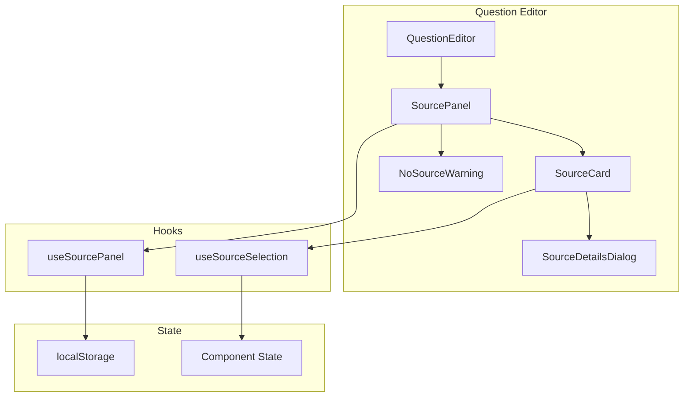

# Design Document: Source Display Improvement

## Overview

This feature enhances the source display functionality in AutoRFP to provide users with better visibility, selection, and control over AI-generated response sources. The implementation adds a collapsible Source Panel that displays all sources with relevance indicators, allows source selection and content usage, and prominently warns users when no sources are found to prevent reliance on potentially hallucinated responses.

## Architecture

The feature follows the existing React component architecture with hooks for state management. The implementation integrates with the existing `question-editor.tsx` component and `SourceDetailsDialog` while adding new components for the source panel.



## Components and Interfaces

### SourcePanel Component

```typescript
interface SourcePanelProps {
  sources: AnswerSource[];
  onSourceClick: (source: AnswerSource) => void;
  onUseContent: (source: AnswerSource) => void;
  isExpanded: boolean;
  onToggle: () => void;
}
```

The SourcePanel is a collapsible sidebar that displays all available sources. It shows the source count, renders SourceCard components for each source, and displays the NoSourceWarning when no sources exist.

### SourceCard Component

```typescript
interface SourceCardProps {
  source: AnswerSource;
  isSelected: boolean;
  onSelect: () => void;
  onUseContent: () => void;
}
```

The SourceCard displays individual source information including file name, relevance score with color indicator, and a text preview. It includes a "Use" button to append content to the answer.

### NoSourceWarning Component

```typescript
interface NoSourceWarningProps {
  questionText?: string;
}
```

The NoSourceWarning displays a prominent alert when no sources are found, warning users about potential hallucination and suggesting actions.

### useSourcePanel Hook

```typescript
interface UseSourcePanelReturn {
  isExpanded: boolean;
  toggle: () => void;
  setExpanded: (expanded: boolean) => void;
}

function useSourcePanel(): UseSourcePanelReturn
```

This hook manages the Source Panel expanded/collapsed state with localStorage persistence.

### Relevance Color Utility

```typescript
type RelevanceColor = 'green' | 'amber' | 'red';

function getRelevanceColor(relevance: number | null | undefined): RelevanceColor
```

Utility function that maps relevance scores to color indicators:
- Green: relevance >= 70
- Amber: relevance >= 40 and < 70
- Red: relevance < 40 or null/undefined

### Source Sorting Utility

```typescript
function sortSourcesByRelevance(sources: AnswerSource[]): AnswerSource[]
```

Utility function that sorts sources by relevance score in descending order.

## Data Models

The feature uses the existing `AnswerSource` type from `types/api.ts`:

```typescript
interface AnswerSource {
  id: number;
  fileName: string;
  filePath?: string;
  pageNumber?: string | number;
  documentId?: string;
  relevance?: number | null;
  textContent?: string | null;
}
```

### LocalStorage Schema

```typescript
interface SourcePanelPreference {
  isExpanded: boolean;
}
```

Key: `autorpf_source_panel_expanded`

## Correctness Properties

*A property is a characteristic or behavior that should hold true across all valid executions of a system-essentially, a formal statement about what the system should do. Properties serve as the bridge between human-readable specifications and machine-verifiable correctness guarantees.*

Based on the prework analysis, the following properties have been identified after removing redundancies:

### Property 1: Source Count Accuracy
*For any* array of sources passed to SourcePanel, the displayed count SHALL equal the length of the source array.
**Validates: Requirements 1.2**

### Property 2: Source Sorting by Relevance
*For any* array of sources with varying relevance scores, the sortSourcesByRelevance function SHALL return sources sorted in descending order by relevance score.
**Validates: Requirements 4.3**

### Property 3: Relevance Color Mapping
*For any* relevance score, the getRelevanceColor function SHALL return:
- 'green' when relevance >= 70
- 'amber' when relevance >= 40 and < 70  
- 'red' when relevance < 40 or null/undefined
**Validates: Requirements 4.4, 4.5, 4.6**

### Property 4: Use Button Disabled State
*For any* source with null, undefined, or empty string textContent, the Use button SHALL be disabled.
**Validates: Requirements 5.4**

### Property 5: Content Append Behavior
*For any* current answer text and source textContent, clicking Use SHALL result in the answer containing the original text followed by the source content.
**Validates: Requirements 5.2**

### Property 6: Panel State Round-Trip
*For any* panel expanded state, storing to localStorage and then retrieving SHALL return the same state value.
**Validates: Requirements 6.1, 6.2**

### Property 7: No Source Warning Display
*For any* empty source array (length === 0), the NoSourceWarning component SHALL be rendered.
**Validates: Requirements 3.1**

## Error Handling

1. **Missing Source Data**: When source fields are null/undefined, display "Unknown" or appropriate fallback text
2. **LocalStorage Unavailable**: Fall back to default collapsed state if localStorage is not accessible
3. **Invalid Relevance Values**: Treat NaN, negative, or values > 100 as low relevance (red indicator)
4. **Empty Text Content**: Disable "Use" button and show tooltip explaining content is unavailable

## Testing Strategy

### Property-Based Testing

The implementation will use **fast-check** as the property-based testing library for TypeScript/JavaScript.

Each property-based test MUST:
- Be tagged with a comment referencing the correctness property: `**Feature: source-display-improvement, Property {number}: {property_text}**`
- Run a minimum of 100 iterations
- Use smart generators that constrain to valid input spaces

### Unit Tests

Unit tests will cover:
- Component rendering with various source configurations
- User interaction handlers (click, toggle)
- Edge cases (empty arrays, null values, boundary relevance scores)

### Test File Structure

```
tests/
├── property/
│   └── source-display.property.test.ts
└── unit/
    └── components/
        └── source-panel.test.ts
```
